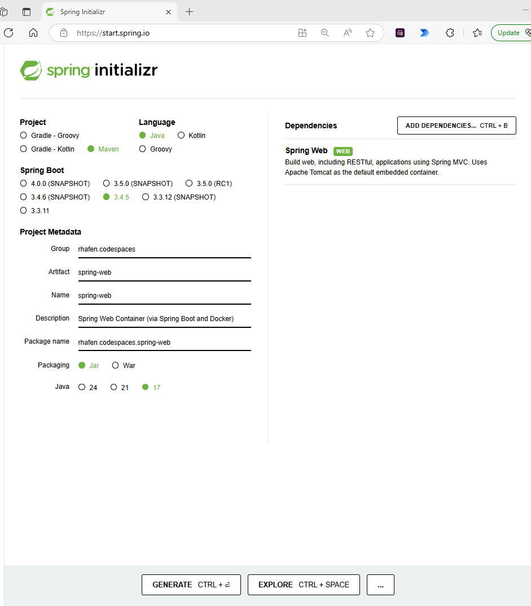

# Github-Codespace of a Spring Boot Application (web & PostgreSQL) &nbsp;&nbsp;&nbsp;&nbsp;&nbsp;&nbsp;&nbsp;&nbsp;&nbsp;&nbsp;Containerized by Docker (Dockerfile & compose.yaml) 
### Step 1) Create (stub out) your Java Spring Web Application 
   - ##### Goto [Spring Boot Initializer](https://start.spring.io/) (https://start.spring.io/) and Select the following:
     

Example Spring-Initializr Screen Shot

### Step 2) Extract the zip file created by Spring Boot Initiliazr (from Step 1) and upload here 

 
